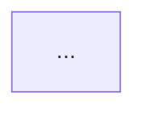

# Flowchart Generation Fix - Summary

## Problem
The flowchart feature was failing with error: "No diagram type detected matching given configuration for text"

The issue was that the AI was returning Mermaid code wrapped in markdown code blocks like:
```

```

This caused Mermaid.js to fail parsing because it expected raw flowchart syntax.

## Solutions Implemented

### 1. Enhanced AI Prompt (`backend/app/utils/prompt_builder.py`)
- Added explicit instructions NOT to use markdown code blocks
- Added CRITICAL FORMATTING RULES section
- Provided clear examples of correct vs incorrect formatting
- Emphasized starting directly with "flowchart TD" or "graph TD"
- Added proper node syntax examples (square brackets, double parentheses, curly braces)

### 2. Improved Response Cleaning (`backend/app/core/flowchart.py`)
- Added comprehensive markdown removal logic
- Handles ````mermaid` prefix removal
- Removes all backticks from response
- Validates output starts with "flowchart" or "graph"
- Attempts to extract valid flowchart from malformed response
- Added debug logging to track raw and cleaned responses
- Returns error message if invalid format is still detected

### 3. Frontend Validation (`components/features/flowchart-renderer.tsx`)
- Added pre-render validation to check syntax
- Enhanced error messages with specific details
- Added console logging for debugging
- Improved Mermaid initialization with better config options
- Added frontend checks before attempting to render

### 4. Workspace Error Handling (`components/features/flowchart-workspace.tsx`)
- Added handling for error responses from backend
- Added console logging to track received Mermaid code
- Better error state management

## Testing

Run the test script to verify:
```bash
cd backend
python test_flowchart.py
```

This will:
1. Generate a flowchart from sample code
2. Validate the output format
3. Show the generated Mermaid code

## Expected Output Format

Valid Mermaid flowchart should look like:
```
flowchart TD
    Start((Start)) --> Process[Do Something]
    Process --> Check{{Is Valid?}}
    Check -->|Yes| Success[Success]
    Check -->|No| Error[Error]
    Success --> End((End))
    Error --> End
```

## Debugging

If issues persist:

1. **Check backend logs** - Look for the logged raw AI response:
   ```
   INFO: Raw AI response: ...
   INFO: Cleaned mermaid code: ...
   ```

2. **Check browser console** - Look for:
   ```
   Received mermaid code: ...
   Invalid mermaid code: ...
   Mermaid render error: ...
   ```

3. **Verify Mermaid syntax** - Use [Mermaid Live Editor](https://mermaid.live) to test the generated code

## Additional Improvements Made

- Added C and C++ language support to code editor
- Enhanced documentation formatting with better code block styling
- Created settings page with user account information
- Added backend `/auth/profile` endpoint for user data
- Improved overall error handling across the application
